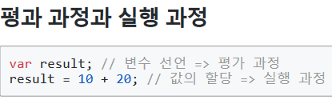
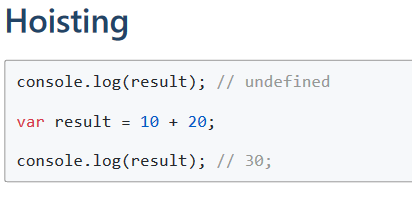

# 변수

1. 변수(식별자)는 값이 아닌 메모리 주소를 기억한다.
2. Hoisting
    JavaScript Hoisting refers to the process whereby the compiler allocates memory for variable and function declarations prior to execution of the code.
    -> 코드 실행 전에 변수와 함수 선언을 위한 메모리 할당 프로세스가 진행

    

    - 변수 선언 => 평가 과정
    - 값의 할당 => 실행 과정

    

3. mutable, immutable
- mutable: objects, arrays
- immutable: 이외의 것
    - performance, reduce memory use, thread-safety

4. Garbage Collector
- 메모리 할당을 모니터링하고 더이상 필요하지 않으면 할당 해제
- 메모리가 필요한지 여부 판단이 100프로 정확하진 않음