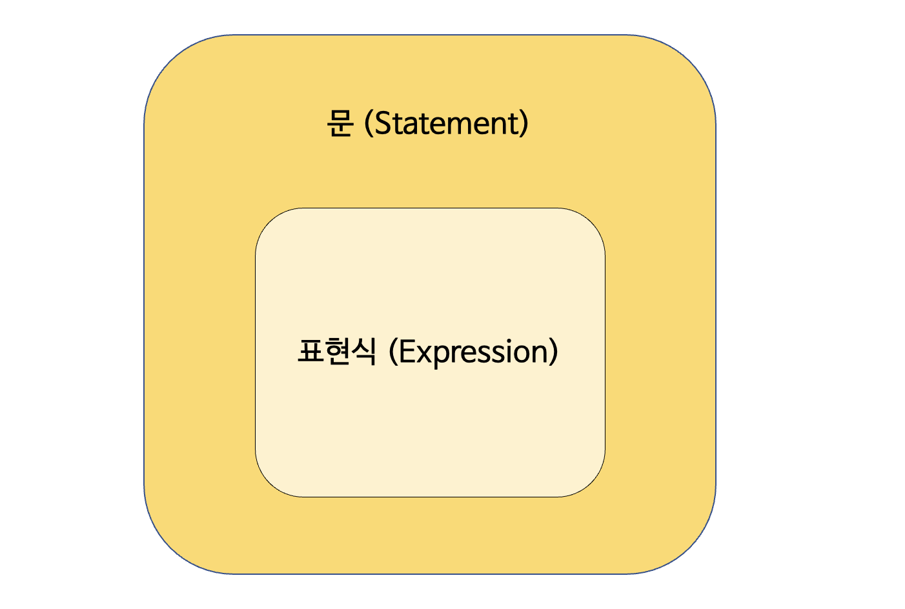

## 값

> 값value은 식(표현식expression)이 평가evaluate되어 생성된 결과를 말한다.
> 

javascript에서 변수를 선언하고 데이터를 할당하면 메모리에 저장된다. 이렇게 할당 된 값은 메모리에 2진수(문자 'A'는 0100 0001)로 저장된다. 이렇게 메모리에 저장된 것이 값

```
var expressionValue = 10 + 20;
var literalValue = 30;
```

여기서 변수 expressionValue에 할당 된 값, 즉 메모리에 저장 된 값은 10+20이 아닌 10+20을 평가(≒계산)한 30이다.
expressionValue와 literalValue 둘 다 값 30이 할당된다. expressionValue의 10+20을 표현식expression, literalValue의 30은 리터럴literal이라고 부른다.

## 리터럴

> 리터럴literal은 사람이 이해할 수 있는 문자 또는 약속된 기호를 사용해 값을 생성하는 표기법을 말한다.
> 

**"값을 생성하기 위해 미리 약속한 표기법"**이라고 볼 수 있다. 예시를 살펴보자.

```
var 정수_리터럴 = 100;
var 부동소수점_리터럴 = 10.5;

var 2진수_리터럴 = 0b0100001;
var 8진수_리터럴 = 0o101;
var 16진수_리터럴 = 0x41;

var 문자열_리터럴 = 'Hello';

var 불리언_리터럴 = true; // 또는 false

var null_리터럴 = null;
var undefined_리터럴 = undefined;

var 객체_리터럴 = { name: 'Lee', address: 'Seoul' }
var 배열_리터럴 = [ 1, 2, 3 ];
var 함수_리터럴 = function() {}

var 정규표현식_리터럴 = /[A-Z]+/g;

```

## 표현식

> 표현식expression은 값으로 평가될 수 있는 문statement이다
> 

값이란 메모리에 저장된 것이라고 봤는데, 표현식이란 메모리에 저장될 수 있는 것들을 이야기한다고 볼 수 있다.    
즉, 값으로 평가될 수 있는 건 모두 표현식이다. 따라서 앞서 봤던 리터럴도 표현식이라고 이야기할 수 있다.

```
// 리터럴 표현식
10
'Hi'

// 식별자 표현식(앞서 선언했다고 가정)
sum
person.name
arr[1]

// 연산자 표현식
10 + 20
sum = 10
sum !== 10

//식별자 참조
sum;

// 함수/메서드 호출 표현식(앞서 선언했다고 가정)
square()
person.getName()

```

## 문

> 문(statement)은 프로그램을 구성하는 기본 단위이자 최소 실행 단위이다.
문의 집합으로 이뤄진 것이 프로그램이며, 문을 작성하고 순서에 맞게 나열하는 것이 프로그래밍이다.
> 

문은 명령문이라고도 부르는데, 문이 실행되면 컴퓨터에 명령을 내려 일을 시키기 때문이다. 마찬가지로 예시를 보면 쉽게 이해할 수 있다.

```
// 변수 선언문
var x;

// 할당문
x = 3;

// 함수 선언문
function foo () {}

// 조건문
if ( ... ) { alert(x); }

// 반복문
for (var i = 0; i < 10; i++) { alert(i); }

```

## 표현식인 문과 표현식이 아닌 문 statement, expression



표현식과 문은 비슷해서 구별하기 어렵다고 느낄 수 있지만 구분법이 있다. 바로 변수에 할당해보는 것이다.
표현식은 값이다. 값은 변수에 할당할 수 있다. 하지만 표현식이 아닌 문은 변수에 할당하면 에러가 발생한다

.

---